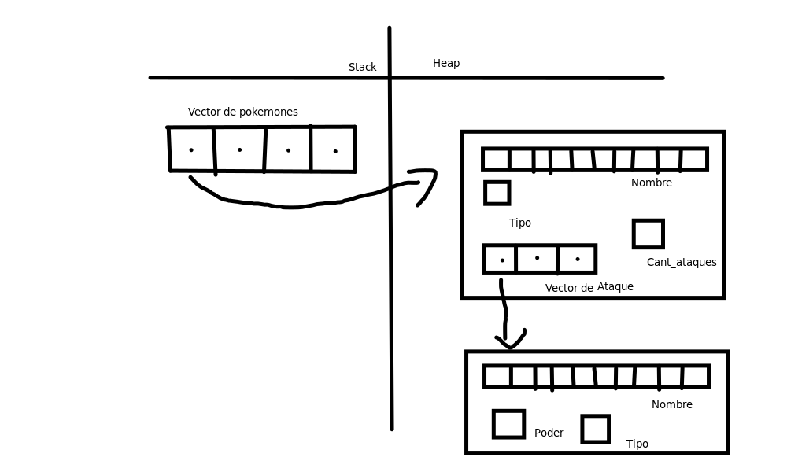

<div align="right">

</div>

# TP1 

## Repositorio de Sebastián Loe - 110106 - sloe@fi.uba.ar

- Para compilar:

```bash
gcc -std=c99 -Wall -Wconversion -Wtype-limits -pedantic -Werror -O2 -g pokemon.c -o pokemon
```

- Para ejecutar:

```bash
./pokemon
```

- Para ejecutar con valgrind:
```bash
make / make valgrind-chanutron
```
---
##  Funcionamiento

El Trabajo consiste en la modificación del archivo pokemon.c. La mayor complejidad del mismo se encuentra en la función 'pokemon_cargar_archivo'. En palabras, el objetivo del trabajo es analizar en profundidad los datos de un archivo con un formato dado en el archivo Enunciado. Principalmente, se trabajó en el correcto manejo de vectores dinámicos y vectores de structs (o punteros a structs en este trabajo en particular). mediante las funciones malloc, calloc y realloc (y free para liberar la memoria).

Específicamente, esta función 'pokemon_cargar_archivo' abre el archivo y lee línea por línea, guardando la información en el struct de pokemon, y luego almacena un puntero a ese struct en un vector dinámico que se amplía a medida que se inserta un nuevo pokemon (o puntero a este).

Esta función lee el archivo hasta que pase una de dos cosas: o bien se termina de leer el archivo y el programa continúa correctamente, o se encuentra un error en el formato o la información del archivo a leer, y se devuelve la información recopilada hasta el momento.
En el caso de que se pueda leer todo el archivo y se guarde la información correctamente, se devuelve info_pokemon, que contiene toda la información recopilada del archivo, antes liberando todos los bloques de memoria que ya no se vayan a usar, como por ejemplo el último pokemon cargado (no refiere al cargado en el vector dinámico sino al cargado en pokemon_t*).

El archivo pokemon.c consta de otras funciones que intentan modificar y/o analizar la información obtenida anteriormente.
Además de la función de la que ya hablamos, este archivo cuenta con otras 8 funciones principales y 3 funciones de modularización del código:

- pokemon_buscar (recorre el vector con la información cargada y compara el nombre pasado por parámetro con el del pokemon evaluado. Devuelve el pokemon cuyo nombre es igual al pasado por parámetro, o NULL si no lo encuentra.)

- pokemon_cantidad (busca y devuelve el número registrado en info_pokemon->cantidad_pokemones)

- pokemon_nombre (busca y devuelve el string registrado en pokemon->nombre)

- pokemon_tipo (busca y devuelve el TIPO registrado en pokemon->tipo)

- pokemon_buscar_ataque (recorre el vector de ataques de un pokemon y compara el nombre pasado por parámetro con el nombre del ataque evaluado. Devuelve el ataque cuyo nombre es igual al pasado por parámetro o NULL si no se encuentra)

- con_cada_pokemon (ordena el vector de pokemones mediante el método de burbujeo y luego aplica la función pasada por parámetro a cada uno de los pokemones de info_pokemon. Devuelve la cantidad de pokemones a los que les fue aplicada la función, que es también ip->cantidad_pokemones)

- con_cada_ataque (aplica la función pasada por parámetro a cada uno de los ataques del pokemon pasado por parámetro mediante un for. Devuelve lacantidad de ataques a los queles fue aplicada la función, que es tambien pokemon->cant_ataques)

- pokemon_destruir_todo (libera toda la memoria para evitar pérdidas. Esta función hace hincapié en liberar todos los aspectos de la memoria individualmente, ya que de lo contrario podría haber una fuga. De esta manera, se libera tanto la memoria del arreglo ip->pokemones como también la memoria asignada para cada pokemon en sí.)

---

## Respuestas a las preguntas teóricas
- Explicar cómo se logra que los pokemon queden ordenados alfabéticamente y cuál es el costo computacional de esta operación.

    Los pokemon se ordenan alfabéticamente de la 'a' a la 'z' mediante el método bubble sort (burbujeo). Explicando este método, se compara el nombre de un pokemon con el nombre del pokemon en la siguiente posición del vector. Se repite este paso hasta que se llegue al final del vector, y se repite esta secuencia hasta que quede el vector completamente ordenado.
    
    Este método de ordenamiento se compone por dos bucles 'for'. El primero de estos itera n-1 veces, mientras que el segundo n-i-1. Dado a que los for estan anidados, la cantidad total de iteraciones es de n*(n-1) en el peor de los casos. Es posible simplificar la complejidad a O(n²).
     

- Explicar con diagramas la disposición de los diferentes elementos en memoria para las diferentes operaciones implementadas.

<div align="center">

</div>